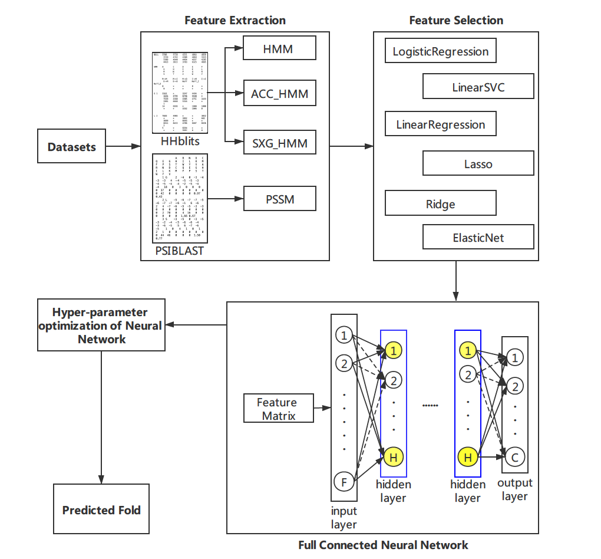

## ASFold-DNN

Protein Fold Recognition based on Evolutionary Features with Variable Parameters using Full Connected Neural Network



### Requirements：

```python3
pip install pandas (1.0.3)
pip install numpy (1.18.1)
pip install sklearn 
pip install keras (2.4.3)
pip install tensorflow (2.4.1)
pip install matplotlib (3.2.1)
```
### Usage
To realize the ASFold-DNN framework, run the following code.

#### Step 1: Obtain the datasets.
The five benchmark datasets including DD, EDD, TG, ASTRAL186 and LE can be obtained from the `data`  folder.

#### Step 2: Feature extraction.
•	pssm.py is used to generate a 40-dimensional PSSM feature matrix.

•	ENAC.py is the implementation of ENAC.

•	hmm.py is used to generate a 20-dimensional HMM feature matrix.

•	SXG.py is used to generate six different groups of 400-dimensional SXG_HMM feature matrices.

The “the first step of ASFold-DNN” part in ASFold-DNN.py is used to realize a preliminary selection of variable parameter of SXG_HMM and ACC_HMM feature extraction methods. 

#### Step 3: Feature selection.
For the initial feature vector sets, the feature selection methods can be used to eliminate redundant and irrelevant information, and retain the optimal feature vectors aiding to classification.

The “the second step of ASFold-DNN” part in ASFold-DNN.py is used to realize a selection of six linear feature selection methods including LinearRegression, LogisticRegression, LinearSVC, Lasso, Ridge and ElasticNet. 

#### Step 4: Construct model.
The “the third step of ASFold-DNN” part in ASFold-DNN.py is used to realize hyper-parameter optimization and construct the final model for the dataset.

